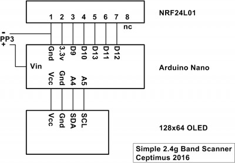

# nRF24L01pScannerOled
2.4GHz spectral scanner with nRF24L01 and SSD1306/SSD1106 OLED display.

## Required hardware

* Arduino (3.3v Pro Mini is best, but Nano or Uno are fine)
* NRF24L01+ tranceiver
* SSD1306 128x64 OLED

Although the NRF24L01+ is a 3.3v part, the IO is 5v tolerant, which is why a 5v Nano or Uno can be used with it. However, it **must** still be powered from 3.3v. 

## Connecting it all up
Connection of the three parts to this project couldn't be much simpler.

After you have connected the Arduino, NRF24L01+ and OLED as shown, make any necessary changes to the code, and upload the project. Instead of an Arduino Nano (as used by the original author, Ceptimus), I used a 3.3v Arduino Pro Mini, so you will need to change that if you are using a Arduino Nano or other board. 

Since I am using what now seems to be the more common SSD1306 (rather than a SSD1106), I have enabled that display, as well as setting the I2C address and bus speed in the project `platformio.ini`. You should only need to change the bus address if your module's internal SA0 has been wired differently (or the solder jumper changed). Testing showed that the I2C could operate at a higher clock rate of 800kHz, but if you have problems, try changing to the 'normal' speed of 400kHz (`400000L`).

## History

The original idea/code is from Ceptimus:
* https://www.rcgroups.com/forums/showthread.php?2777178-Very-cheap-Arduino-based-2-4-GHz-band-monitor

Benik3 made changes for faster display driving:
- Asynchronous scan and OLED draw - scanning is made with interrupt
- Redraw only bytes which really changed from previous draw
- Function to draw line from array for faster draw of long line
- Faster I2C clock by default (800kHz)
- faster SSD1306 OLED clock
